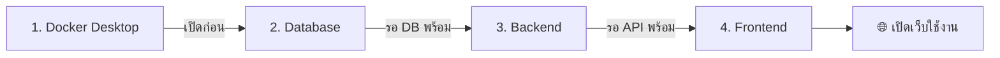

# 🏍️ คู่มือเปิดใช้งานระบบ — Motorcycle Parts Shop

## ต้องเปิด 3 อย่าง ตามลำดับนี้



---

## ขั้นตอนที่ 1 — เปิด Docker Desktop

- เปิดแอป **Docker Desktop** จาก Start Menu
- **รอ** จนไอคอนที่ System Tray (มุมขวาล่าง) เป็น **สีเขียว** = Engine Running

---

## ขั้นตอนที่ 2 — เปิด Database (PostgreSQL)

เปิด **Terminal ที่ 1** แล้วรัน:

```powershell
cd C:\Users\salan\Desktop\motorcycle-parts-shop
docker compose up -d
```

> ✅ สำเร็จ = ขึ้น `Container motorcycle-postgres Started`

---

## ขั้นตอนที่ 3 — เปิด Backend (FastAPI)

เปิด **Terminal ที่ 2** แล้วรัน:

```powershell
cd C:\Users\salan\Desktop\motorcycle-parts-shop\backend
python -m uvicorn app.main:app --reload
```

> ✅ สำเร็จ = ขึ้น `Application startup complete.`
>
> API จะทำงานที่ **http://localhost:8000**

---

## ขั้นตอนที่ 4 — เปิด Frontend (Next.js)

เปิด **Terminal ที่ 3** แล้วรัน:

```powershell
cd C:\Users\salan\Desktop\motorcycle-parts-shop\frontend
npm run dev
```

> ✅ สำเร็จ = ขึ้น `Ready on http://localhost:3000`

---

## เปิดเว็บใช้งาน 🌐

เปิดเบราว์เซอร์ไปที่ **http://localhost:3000**

### ข้อมูล Login

| บทบาท | Username | Password | สิทธิ์ |
|---|---|---|---|
| 🔑 เจ้าของร้าน | `admin` | `admin123` | ดู + เพิ่ม/แก้ไข/ลบ หมวดหมู่ |
| 👷 พนักงาน | `staff01` | `staff123` | ดูอย่างเดียว |

---

## ปิดระบบ

| ส่วน | วิธีปิด |
|---|---|
| Frontend | กด `Ctrl+C` ใน Terminal ที่ 3 |
| Backend | กด `Ctrl+C` ใน Terminal ที่ 2 |
| Database | รัน `docker compose down` ใน Terminal ที่ 1 |

---

## แก้ปัญหาเบื้องต้น

| ปัญหา | สาเหตุ | วิธีแก้ |
|---|---|---|
| `Unable to connect to docker` | Docker Desktop ยังไม่เปิด | เปิด Docker Desktop แล้วรอให้พร้อม |
| `Connection refused :8000` | Backend ยังไม่ได้เปิด | รัน `python -m uvicorn app.main:app --reload` ในโฟลเดอร์ backend |
| `ENOENT package.json` | รัน npm ผิดโฟลเดอร์ | ต้องรันใน `frontend/` ไม่ใช่ root |
| `Application startup failed` (bcrypt) | bcrypt version ไม่เข้ากัน | รัน `pip install bcrypt==4.0.1` |
| Login ไม่ผ่าน | Backend ไม่ได้เปิด หรือ DB ไม่ได้เปิด | ตรวจสอบว่าขั้นตอน 1-3 เปิดครบ |
